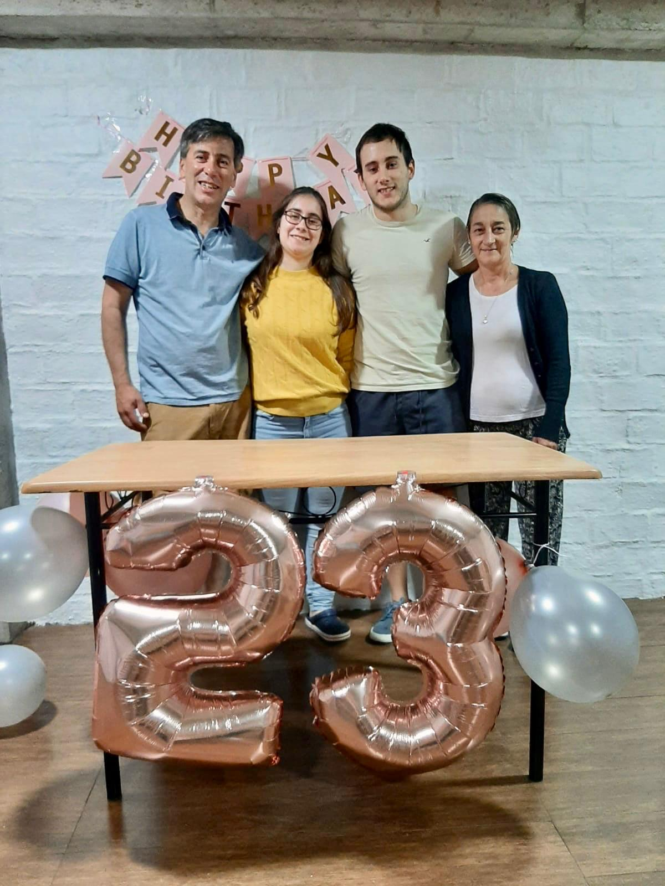
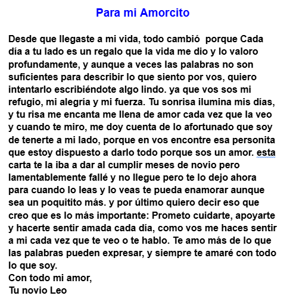
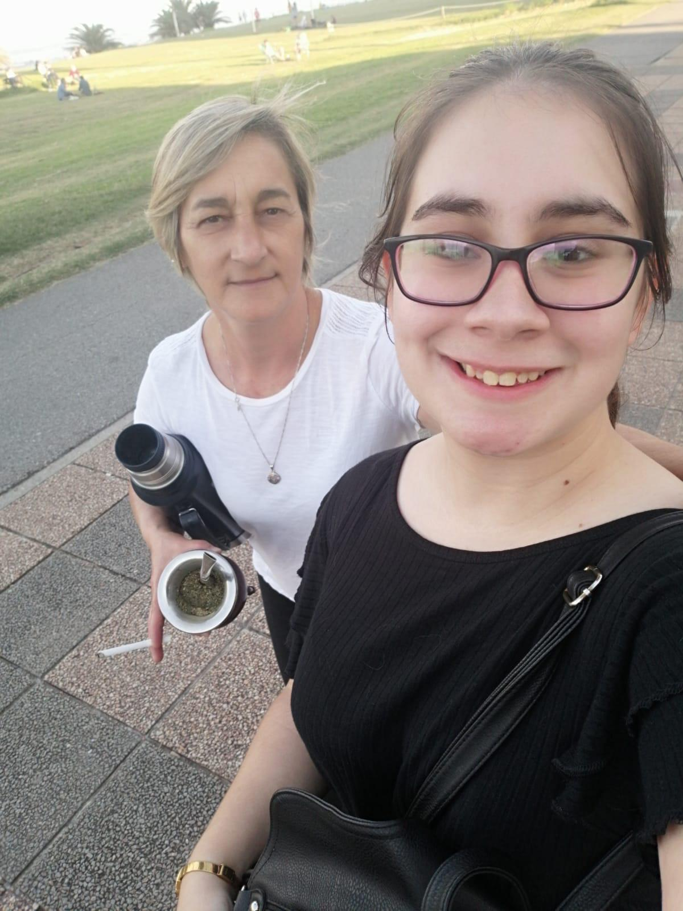
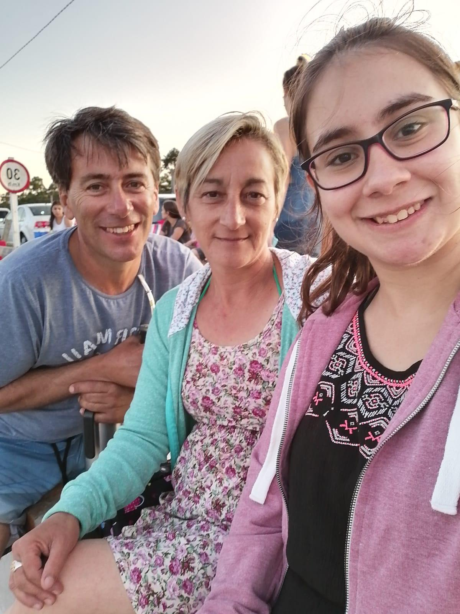
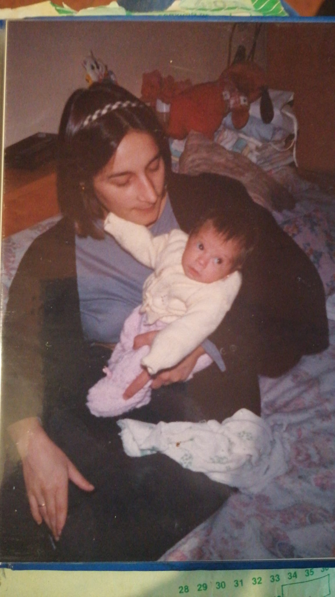

<!DOCTYPE html>
<html lang="es">
<head>
    <meta charset="UTF-8">
    <meta name="viewport" content="width=device-width, initial-scale=1.0">
    <title>Cuadrado 3x3 con Modal</title>
    
</head>
<body>

    <!-- Grid de imágenes -->
    

        

        

        

        

        

        

        

        

        

    

    <!-- Modal para imagen ampliada -->
    

        &times;
        
    

    

</body>
</html>
